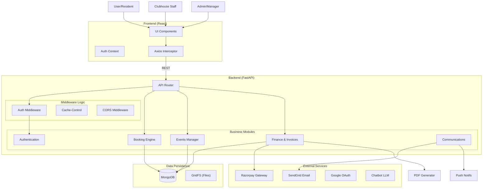

# TROA System Architecture & Implementation Guide

> **Version:** 2.0 (Deep Dive)
> **Last Updated:** 2026-02-05
> **Purpose:** Detailed technical reference for AI Agents and Developers.

---

## 1. Executive Summary
The TROA (The Retreat Owners Association) platform is a full-stack facility, event, and financial management system for a residential community. It automates complex workflows including facility bookings with quota capping, event ticketing with variable pricing, direct invoicing for maintenance dues, and role-based access control for different staff levels.

## 2. Technology Stack & Infrastructure

### 2.1 Backend Core
- **Framework:** FastAPI (Python 3.9+)
- **Server:** Uvicorn (ASGI)
- **Database Driver:** Motor (AsyncIO MongoDB driver)
- **Validation:** Pydantic (Strict typing)
- **Environment:** Dotenv (`.env` file)

### 2.2 Frontend Core
- **Library:** React 18
- **Build Tool:** Webpack / CRACO (Create React App Configuration Override)
- **Styling:** Tailwind CSS + Shadcn UI (Radix Primitives)
- **State:** React Context API (`AuthContext`)
- **Routing:** React Router v6

### 2.3 Key Dependencies
- **Payments:** `razorpay` (Python client)
- **Email:** `sendgrid` (Transactional emails)
- **PDF Generation:** `reportlab` (Invoices/Reports)
- **Data Processing:** `pandas` (Export/Import)
- **Security:** `bcrypt`, `pyjwt` (likely), `itsdangerous`

### 2.4 Infrastructure
- **Containerization:** Docker + Docker Compose
- **Database:** MongoDB (Containerized)
- **Reverse Proxy:** Nginx (Production)

---

## 3. High-Level Architecture

---

## 4. Deep Dive: Authentication & Security

### 4.1. Authentication Methods
The system supports dual authentication strategies:
1.  **Google OAuth 2.0:**
    *   **Flow:** Frontend initiates -> Google Redirection -> Callback to Backend -> Token Verification -> User Creation/Login.
    *   **Auto-Verification:** Google-authenticated users are automatically marked as `email_verified=True`.
2.  **Email/Password (Basic Auth):**
    *   **Registration:** User signs up -> `verification_token` generated.
    *   **Verification:** Email sent with link. User cannot login until verified (14-day grace period may apply).
    *   **Storage:** `bcrypt` hashed passwords.

### 4.2. Session Management
- **Mechanism:** JWT (JSON Web Tokens) or Server-side Session Tokens (UUIDs) stored in MongoDB `sessions` collection.
- **Verification:** `get_current_user` dependency checks the token header/cookie against the database.
- **Timeout:** Sessions likely expire after a set duration (e.g., 7-30 days).

### 4.3. Role-Based Access Control (RBAC)
The system strictly enforces 5 distinct roles via Python decorators (`@require_auth`, `@require_admin`, etc.):

| Role | Permissions | Scope |
| :--- | :--- | :--- |
| `user` | Basic access | Can book amenities, register for events, view own invoices. |
| `clubhouse_staff` | Operational access | Can verify bookings (check-in), view facility usage. |
| `accountant` | Financial access | Can view/create **Maintenance** invoices only. Cannot manage events. |
| `manager` | Management access | Can create events, approve/reject offline payments, manage bookings. |
| `admin` | Superuser access | Full access, including user management and system settings. |

---

## 5. Deep Dive: Booking Engine

### 5.1. Core Logic (`backend/server.py`)
- **Slots:** Fixed durations of **30 minutes** or **60 minutes**.
- **Conflict Detection:** Compares `(booking_date, start_time, end_time)` against `status="confirmed"` records in MongoDB.
- **Constraints:**
    - Max **3 additional guests** per booking.
    - Resident guests **must** have a `villa_number`.
    - `booking_date` cannot be in the past.

### 5.2. Pricing & Guest Rules
The system implements a specific charging model defined in `backend/pdf_service.py` and `server.py`:

1.  **Residents:**
    *   **Base Charge:** Free (covered by maintenance).
    *   **Cap:** `RESIDENT_MONTHLY_CAP = ₹300.0` per month per amenity (soft cap for invoicing).
2.  **Guests:**
    *   **External Guest:** `GUEST_CHARGE = ₹50.0` per session.
    *   **Coach:** `GUEST_CHARGE = ₹50.0` per session.
    *   **Billing:** Guest charges are **never capped**. They are added on top of resident caps.

---

## 6. Deep Dive: Event Management

### 6.1. Event Configuration
Events (`backend/events.py`) can be configured with complex pricing models:
- **Payment Type:**
    - `per_villa`: Fixed price regardless of attendee count.
    - `per_person`: Price multiplier based on attendees.
- **Per-Person Subtypes:**
    - `uniform`: Same price for everyone.
    - `adult_child`: Separate `adult_price` and `child_price`.

### 6.2. Registration State Machine
1.  **Initiated:** User submits registration.
2.  **Pending:**
    - If `online`: Waiting for Razorpay callback.
    - If `offline`: Waiting for Admin Approval (`payment_status="pending_approval"`).
3.  **Completed:**
    - `online`: Auto-transition on webhook/verification.
    - `offline`: Admin manually approves, adding audit log.
4.  **Withdrawn:** User cancels. Refunds handled manually via email.

---

## 7. Deep Dive: Financial Module (Invoicing)

### 7.1. Invoice Types
The system handles two distinct categories of financial records:

#### A. Clubhouse Subscription Invoices
- **Trigger:** Generated monthly (likely via script or manual admin trigger).
- **Calculation Logic:**
    1.  Aggregates all bookings for a Villa + Amenity for the month.
    2.  Calculates **Resident Cost**: `min(usage_count * 50, 300)`. (Cap applied).
    3.  Adds **Guest Cost**: `guest_count * 50`. (No cap).
    4.  Adds **Coach Cost**: `coach_count * 50`. (No cap).
    5.  **Total:** Resident Cost + Guest Cost + Coach Cost.

#### B. Maintenance Invoices
- **Trigger:** Created manually by `accountant` or `admin`.
- **Structure:** Free-form line items (Description, Qty, Rate).
- **Target:** Assigned to a `villa_number` (not just a user). Notifies all users linked to that villa.
- **Discounting:** Supports `percentage` or `fixed` discounts.

### 7.2. Payment Workflow
- **Gateway:** Razorpay.
- **Flow:**
    1.  `create-order`: Generates Razorpay Order ID.
    2.  `verify-payment`: Validates `razorpay_signature` using HMAC-SHA256.
    3.  **Offline method:** User uploads Transaction ID -> Admin reviews (`approve-offline` / `reject-offline`) -> Audit log updated.

---

## 8. Deep Dive: Communications

### 8.1. Email Service (`backend/email_service.py`)
- **Provider:** SendGrid.
- **Templating:** Likely uses HTML templates with string replacement.
- **Triggers:**
    - `welcome`: New user registration.
    - `booking_confirmation`: Successful booking.
    - `event_registration`: On signup.
    - `invoice_raised`: When a new bill is generated.
    - `payment_receipt`: On successful payment.
    - `admin_notification`: For new feedback/membership apps.

### 8.2. Push Notifications
- **Target:** Admins (for ops) and Users (for status updates).
- **Structure:** Title + Body + URL Action.

---

## 9. Data Models (MongoDB Schema)

### 9.1. Core Collections
- **`users`**:
    - `role`: Enum (admin/manager/staff/user).
    - `villa_number`: Critical for linking to invoices/maintenance.
- **`villas`**:
    - `emails`: Array of owner/tenant emails permissions.
- **`invoices`**:
    - `line_items`: Array (detailed breakdown).
    - `payment_status`: State tracking.
    - `audit_log`: immutable history of changes.
- **`amenities` / `bookings`**:
    - `guests`: JSON array storing guest details.
- **`events` / `event_registrations`**:
    - `registrants`: Array of actual attendees.

### 9.2 Audit Logging
A dedicated `AuditLogEntry` schema is embedded in critical documents (`invoices`, `bookings`, `registrations`) to track:
- `action` (e.g., "offline_payment_approved")
- `by_email` (Who performed it)
- `timestamp`
- `details` (Context)

---

## 10. DevOps & Deployment
- **Docker:** Multi-stage builds (likely).
- **Environment Variables:**
    - `MONGO_URL`: Database connection.
    - `SENDGRID_API_KEY`, `SENDER_EMAIL`: Email.
    - `RAZORPAY_KEY_ID`, `RAZORPAY_KEY_SECRET`: Payments.
    - `REACT_APP_BACKEND_URL`: Frontend configuration.
